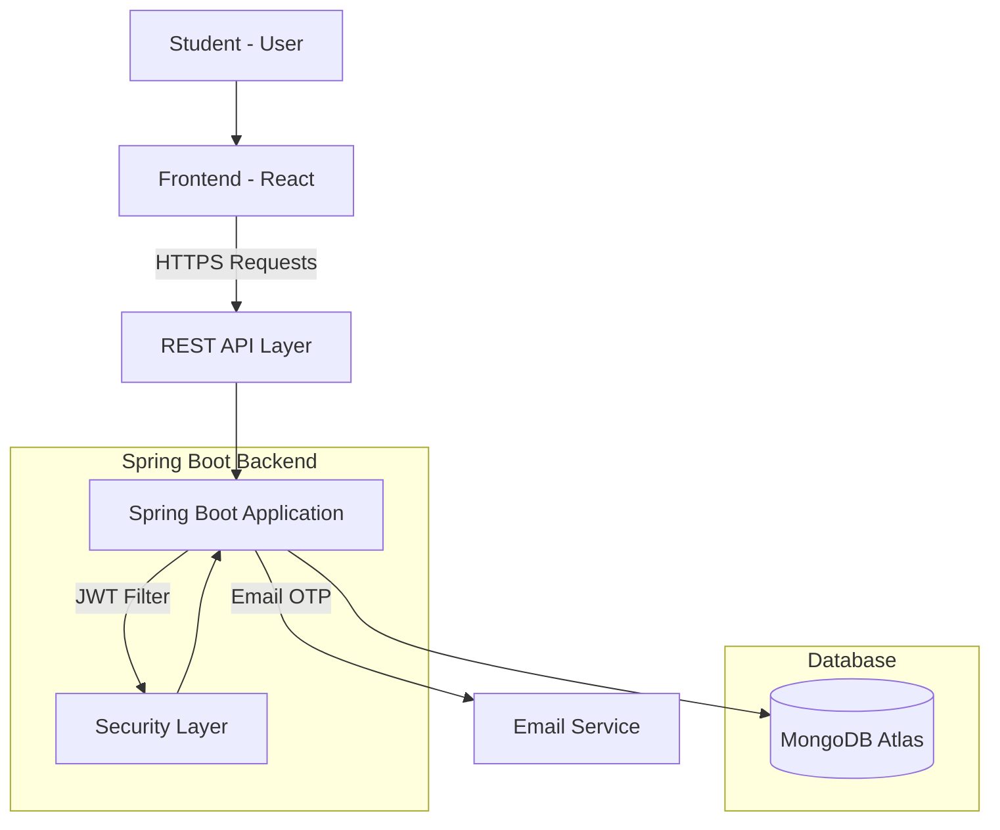
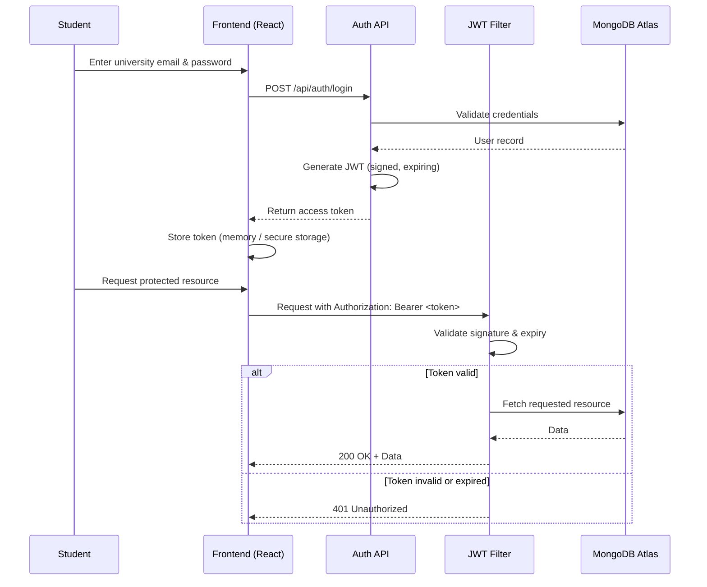
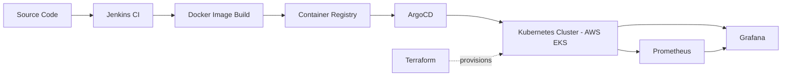

<div align="center">

# Helpify

**Peer-to-peer campus super-app for student assistance**

Helpify connects students who need help with students willing to help — task delivery, campus community, and secure student-only infrastructure, in one platform.

[](https://www.java.com)
[](https://spring.io/projects/spring-boot)
[](https://www.mongodb.com/atlas)
[](https://jwt.io)
[](https://react.dev)
[](https://render.com)
[](https://vercel.com)
[](LICENSE)
[](https://opensource.org)

[Overview](#overview) ·
[Features](#features) ·
[Architecture](#architecture) ·
[API Docs](#api-documentation) ·
[Getting Started](#getting-started) ·
[Roadmap](#roadmap) ·
[Contributing](#contributing)

</div>

---

## Overview

Helpify is a campus-focused platform built for students, by students. It solves a simple, recurring problem: everyday tasks — picking up food, collecting a parcel, delivering a document, running an errand — are small on their own, but add up to real friction in a student's day. Helpify lets students post these tasks as **requests** and lets other students **accept, complete, and get rewarded** for fulfilling them.

Beyond task delivery, Helpify includes a lightweight **campus community feed** — a space for asking questions, seeking guidance from seniors, sharing campus updates, and posting anonymously when needed.

The platform is built around a **closed, verified student ecosystem**: access is gated behind university email verification, and all sensitive operations are protected by JWT-based authentication.

### Mission

> Reduce everyday student inconvenience by connecting students who need help with students willing to help.

---

## Features

### 🔐 Authentication

| Capability | Description |
|---|---|
| University email verification | Restricts signup to verified Bennett University email addresses |
| OTP verification | One-time password sent via email to confirm identity |
| JWT authentication | Stateless, token-based session management |
| Forgot password | Secure password reset flow via email OTP |
| Secure login/logout | Credential validation with token invalidation on logout |
| Role-ready architecture | Authentication layer designed to support role-based access control in future releases |

### 📦 Orders (Task Requests)

| Capability | Description |
|---|---|
| Create requests | Post a task with details, location, and reward |
| Accept requests | Any eligible student can accept an open request |
| Complete requests | Mark accepted requests as fulfilled |
| Cancel requests | Requesters can cancel before completion |
| Reward-based requests | Optional incentive attached to a task |
| Nearby order discovery | Surface requests relevant to the student's location |
| Gender preference support | Optional preference filter for task matching |
| Request history | Full historical log of a student's requests |
| Dashboard statistics | Aggregate stats on activity, completions, and rewards |
| Active order filtering | View only currently open or in-progress orders |
| Delivered order history | Archive of successfully completed orders |

### 💬 Community

| Capability | Description |
|---|---|
| Campus Tea | Informal, casual campus discussion space |
| Senior guidance | Dedicated space for juniors to ask seniors for advice |
| Random questions | General Q&A open to the whole community |
| Anonymous posting | Post without revealing identity |
| Comments | Threaded discussion on posts |
| Likes | Lightweight engagement signal |
| Views | View-count tracking per post |
| Community feed | Unified, chronological feed of all posts |

### 👤 Profile

| Capability | Description |
|---|---|
| User profile | Editable student profile |
| Phone number | Contact field for coordination |
| Gender | Used optionally for order matching preferences |
| Profile information | Bio and general account metadata |

### 🛡️ Security

| Capability | Description |
|---|---|
| JWT filter | Custom servlet filter validating tokens on every protected request |
| Protected REST APIs | Endpoint-level authorization enforcement |
| Email verification | Prevents unauthorized or fake account creation |
| Secure authentication | Password hashing and token-based session handling |

---

## Tech Stack

<table>
<tr>
<td valign="top" width="25%">

**Backend**
- Spring Boot
- Java
- Spring Data MongoDB
- MongoDB Atlas
- JWT
- Maven
- REST APIs

</td>
<td valign="top" width="25%">

**Frontend**
- React
- HTML
- CSS
- JavaScript

</td>
<td valign="top" width="25%">

**Deployment**
- Render (backend)
- Vercel (frontend)
- MongoDB Atlas (database)

</td>
<td valign="top" width="25%">

**Planned Infrastructure**
- Docker
- Kubernetes
- AWS
- Terraform
- Jenkins
- ArgoCD

</td>
</tr>
</table>

---

## Architecture

### System Overview



### JWT Authentication Flow



---

## Database

Helpify uses **MongoDB Atlas** as its primary data store. The schema is intentionally document-oriented rather than relational, favoring flexibility for a fast-moving product.

| Collection | Purpose |
|---|---|
| `users` | Stores student accounts — university email, hashed password, verification status, phone number, gender, profile metadata, and JWT-related fields (e.g. refresh tokens, OTP codes). |
| `orders` | Stores task requests — requester, acceptor, task type, description, location, reward, status (`OPEN`, `ACCEPTED`, `COMPLETED`, `CANCELLED`), gender preference, and timestamps. |
| `posts` | Stores community feed content — author (or anonymized reference), category (Campus Tea, Senior Guidance, Random Questions), body text, comments, like count, and view count. |

---

## Project Structure

<table>
<tr>
<td valign="top" width="50%">

**Backend** (`helpify-backend/`)

```
helpify-backend/
├── src/
│   ├── main/
│   │   ├── java/com/helpify/
│   │   │   ├── config/
│   │   │   │   ├── SecurityConfig.java
│   │   │   │   └── JwtFilter.java
│   │   │   ├── controller/
│   │   │   │   ├── AuthController.java
│   │   │   │   ├── OrderController.java
│   │   │   │   ├── PostController.java
│   │   │   │   └── ProfileController.java
│   │   │   ├── service/
│   │   │   │   ├── AuthService.java
│   │   │   │   ├── OrderService.java
│   │   │   │   ├── PostService.java
│   │   │   │   └── EmailService.java
│   │   │   ├── repository/
│   │   │   │   ├── UserRepository.java
│   │   │   │   ├── OrderRepository.java
│   │   │   │   └── PostRepository.java
│   │   │   ├── model/
│   │   │   │   ├── User.java
│   │   │   │   ├── Order.java
│   │   │   │   └── Post.java
│   │   │   ├── dto/
│   │   │   ├── security/
│   │   │   │   └── JwtUtil.java
│   │   │   └── HelpifyApplication.java
│   │   └── resources/
│   │       └── application.properties
│   └── test/
├── pom.xml
└── README.md
```

</td>
<td valign="top" width="50%">

**Frontend** (`helpify-frontend/`)

```
helpify-frontend/
├── public/
│   └── index.html
├── src/
│   ├── assets/
│   ├── components/
│   │   ├── auth/
│   │   ├── orders/
│   │   ├── community/
│   │   └── profile/
│   ├── pages/
│   │   ├── Login.jsx
│   │   ├── Dashboard.jsx
│   │   ├── Orders.jsx
│   │   ├── CommunityFeed.jsx
│   │   ├── Statistics.jsx
│   │   └── Profile.jsx
│   ├── services/
│   │   └── api.js
│   ├── context/
│   │   └── AuthContext.jsx
│   ├── utils/
│   ├── App.jsx
│   └── index.js
├── package.json
└── README.md
```

</td>
</tr>
</table>

---

## API Documentation

Base URL (local): `http://localhost:8080/api`

### Authentication APIs

| Method | Endpoint | Description | Auth Required |
|---|---|---|---|
| `POST` | `/api/auth/register` | Register a new student using university email | No |
| `POST` | `/api/auth/verify-otp` | Verify OTP sent to university email | No |
| `POST` | `/api/auth/login` | Authenticate and receive a JWT | No |
| `POST` | `/api/auth/logout` | Invalidate current session token | Yes |
| `POST` | `/api/auth/forgot-password` | Trigger password reset OTP | No |
| `POST` | `/api/auth/reset-password` | Reset password using OTP | No |

### Order APIs

| Method | Endpoint | Description | Auth Required |
|---|---|---|---|
| `POST` | `/api/orders` | Create a new task request | Yes |
| `GET` | `/api/orders/nearby` | Fetch nearby open orders | Yes |
| `GET` | `/api/orders/active` | Fetch current user's active orders | Yes |
| `GET` | `/api/orders/history` | Fetch current user's order history | Yes |
| `PATCH` | `/api/orders/{id}/accept` | Accept an open order | Yes |
| `PATCH` | `/api/orders/{id}/complete` | Mark an accepted order as completed | Yes |
| `PATCH` | `/api/orders/{id}/cancel` | Cancel an order | Yes |
| `GET` | `/api/orders/stats` | Fetch dashboard statistics | Yes |

### Post APIs

| Method | Endpoint | Description | Auth Required |
|---|---|---|---|
| `GET` | `/api/posts` | Fetch community feed | Yes |
| `POST` | `/api/posts` | Create a new post (optionally anonymous) | Yes |
| `GET` | `/api/posts/{id}` | Fetch a single post with comments | Yes |
| `POST` | `/api/posts/{id}/comments` | Add a comment to a post | Yes |
| `POST` | `/api/posts/{id}/like` | Like or unlike a post | Yes |
| `DELETE` | `/api/posts/{id}` | Delete own post | Yes |

### Sample Request

```bash
curl -X POST https://api.helpify.app/api/orders \
  -H "Authorization: Bearer <JWT_TOKEN>" \
  -H "Content-Type: application/json" \
  -d '{
    "title": "Pick up parcel from campus gate",
    "description": "Parcel under my name at Gate 2 security",
    "location": "Gate 2",
    "reward": 50,
    "genderPreference": "ANY"
  }'
```

### Sample Response

```json
{
  "id": "6650f1c2a4e3b21f0c9d8e77",
  "title": "Pick up parcel from campus gate",
  "status": "OPEN",
  "requester": "arnav.raj@bennett.edu.in",
  "reward": 50,
  "createdAt": "2026-07-16T10:24:00Z"
}
```

---

## Screenshots

> Screenshots will be added as the UI stabilizes. Placeholders below indicate final layout structure.

| Login | Dashboard |
|---|---|
| `docs/screenshots/login.png` | `docs/screenshots/dashboard.png` |

| Orders | Community Feed |
|---|---|
| `docs/screenshots/orders.png` | `docs/screenshots/community-feed.png` |

| Statistics | Profile |
|---|---|
| `docs/screenshots/statistics.png` | `docs/screenshots/profile.png` |

---

## Getting Started

### Prerequisites

- Java 17+
- Node.js 18+ and npm
- Maven 3.8+
- MongoDB Atlas account (or local MongoDB instance)
- SMTP credentials or SendGrid API key for email/OTP delivery

### Clone the Repository

```bash
git clone https://github.com/<your-org>/helpify.git
cd helpify
```

### Backend Setup

```bash
cd helpify-backend

# Configure environment variables (see below)
cp .env.example .env

# Install dependencies and run
mvn clean install
mvn spring-boot:run
```

The backend will start on `http://localhost:8080`.

### Frontend Setup

```bash
cd helpify-frontend

npm install
npm run dev
```

The frontend will start on `http://localhost:5173` (or the port configured by your React tooling).

---

## Environment Variables

Create a `.env` file (or configure `application.properties` / your deployment platform's environment settings) with the following:

| Variable | Description |
|---|---|
| `MONGO_URI` | MongoDB Atlas connection string |
| `JWT_SECRET` | Secret key used to sign and verify JWTs |
| `MAIL_USER` | SMTP username used for sending OTP and verification emails |
| `MAIL_PASS` | SMTP password / app password |
| `SENDGRID_API_KEY` | API key for SendGrid, used as an alternative or fallback email provider |

```env
MONGO_URI=mongodb+srv://<user>:<password>@cluster.mongodb.net/helpify
JWT_SECRET=your-256-bit-secret
MAIL_USER=your-email@example.com
MAIL_PASS=your-app-password
SENDGRID_API_KEY=SG.xxxxxxxxxxxxxxxxxxxxxxxx
```

> Never commit `.env` files or real secrets to version control. Use `.env.example` as a template only.

---

## Deployment

| Component | Platform | Notes |
|---|---|---|
| Backend | [Render](https://render.com) | Deployed as a Spring Boot web service; environment variables configured in the Render dashboard |
| Frontend | [Vercel](https://vercel.com) | Deployed as a static React build with automatic deployments on push to `main` |
| Database | [MongoDB Atlas](https://www.mongodb.com/atlas) | Managed cluster with IP allow-listing and database-user authentication |

---

## Roadmap

- [x] Authentication (email verification, OTP, JWT)
- [x] Orders (create, accept, complete, cancel)
- [x] Dashboard statistics
- [ ] Community feed *(in progress)*
- [ ] Realtime notifications
- [ ] Cloudinary media uploads
- [ ] Bookmarks
- [ ] Reports and moderation tools
- [ ] Admin panel
- [ ] Kubernetes deployment
- [ ] CI/CD pipeline
- [ ] Prometheus monitoring
- [ ] Grafana dashboards
- [ ] Mobile app

---

## Future Architecture

As Helpify scales beyond a single-region deployment, the infrastructure is planned to migrate toward a containerized, cloud-native stack:



This target architecture introduces:

- **Docker** — containerized builds for consistent environments
- **Kubernetes** — orchestration and horizontal scaling
- **AWS** — cloud infrastructure (EKS, S3, IAM)
- **Terraform** — infrastructure as code
- **Jenkins** — continuous integration pipelines
- **ArgoCD** — GitOps-based continuous delivery
- **Prometheus / Grafana** — metrics collection and observability dashboards

---

## Contributing

Contributions are welcome. Please follow the workflow below:

1. **Fork** the repository
2. Create a feature branch
   ```bash
   git checkout -b feature/your-feature-name
   ```
3. **Commit** your changes with clear, descriptive messages
   ```bash
   git commit -m "feat: add nearby order discovery filter"
   ```
4. Push to your fork and open a **Pull Request** against `main`
5. Ensure your PR description explains the *what* and *why* of the change

### Code Style

- Backend: follow standard Java conventions; keep controllers thin and push logic into services
- Frontend: functional components with hooks; keep components small and composable
- Commit messages follow [Conventional Commits](https://www.conventionalcommits.org/)
- Run existing tests and add new ones for any behavioral change before submitting a PR

---

## License

This project is licensed under the **MIT License** — see the [LICENSE](LICENSE) file for details.

---

## Authors

| Role | Name |
|---|---|
| Founder & CEO | Arnav Raj |
| Co-Founder & CTO | Arpanel Franklin |

---

## Contact

- GitHub: `github.com/<your-org>/helpify`
- LinkedIn: `linkedin.com/in/<your-profile>`
- Email: `contact@helpify.app`
- Portfolio: `<your-portfolio-url>`

---

<div align="center">

Built for students, by students.

</div>